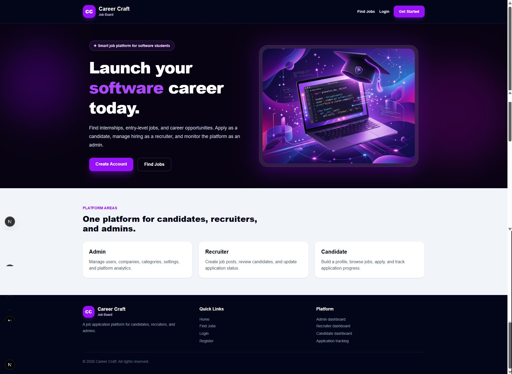
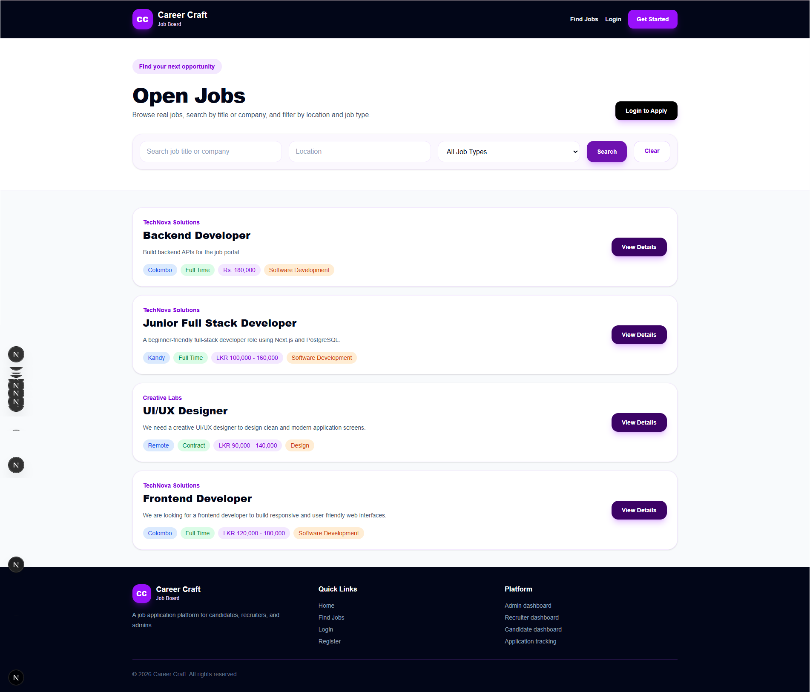
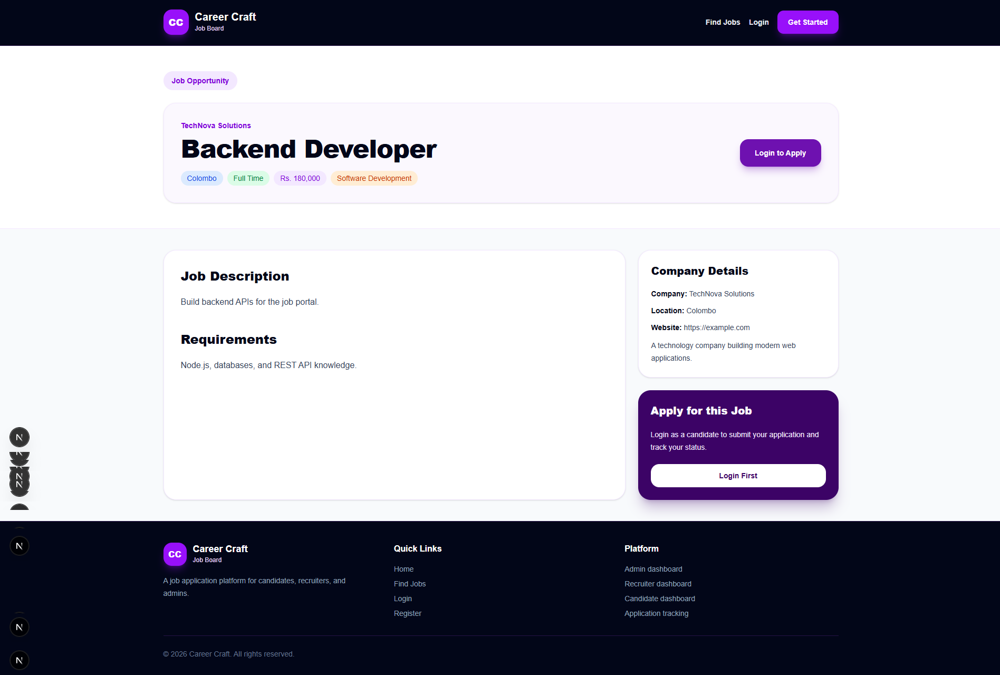
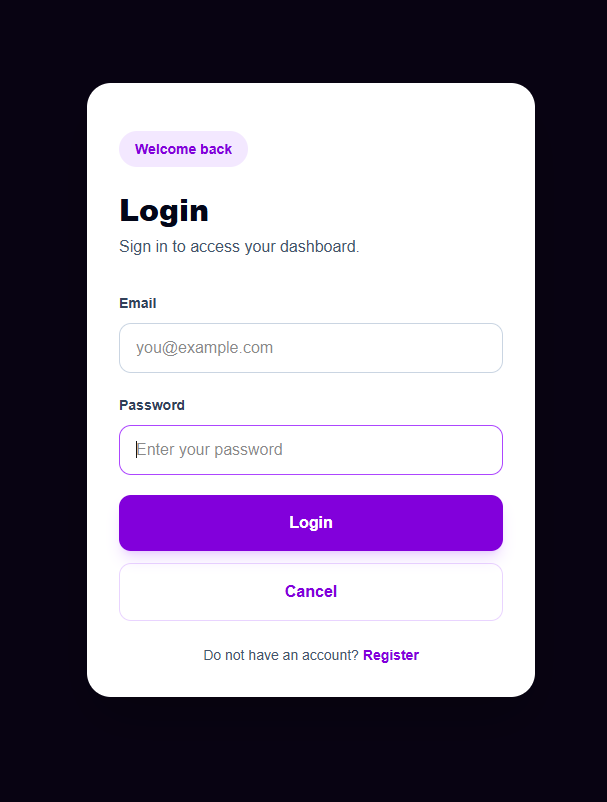
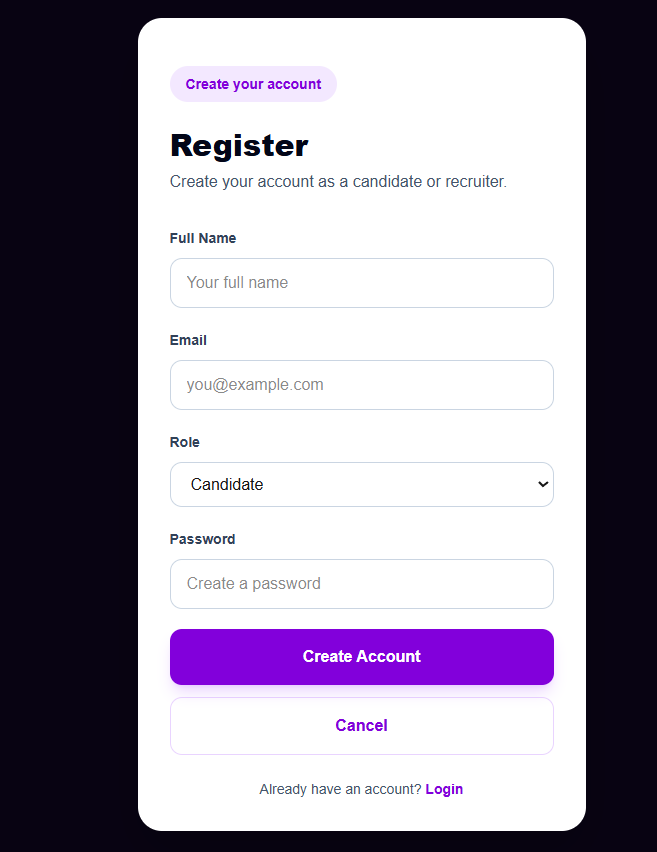
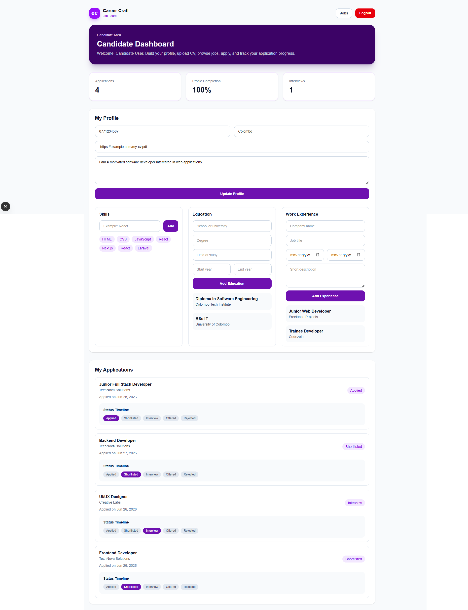
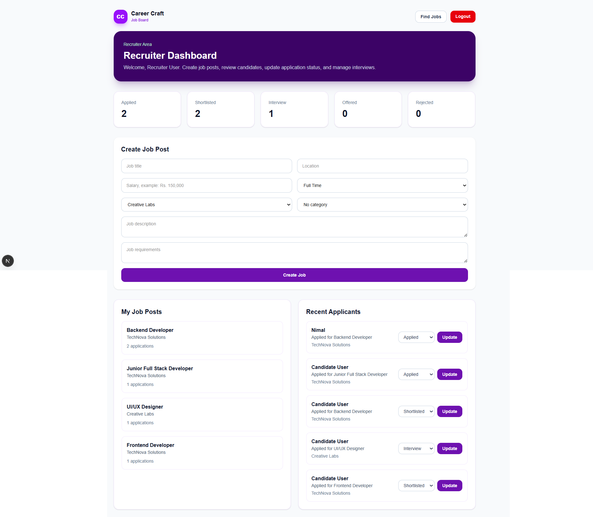
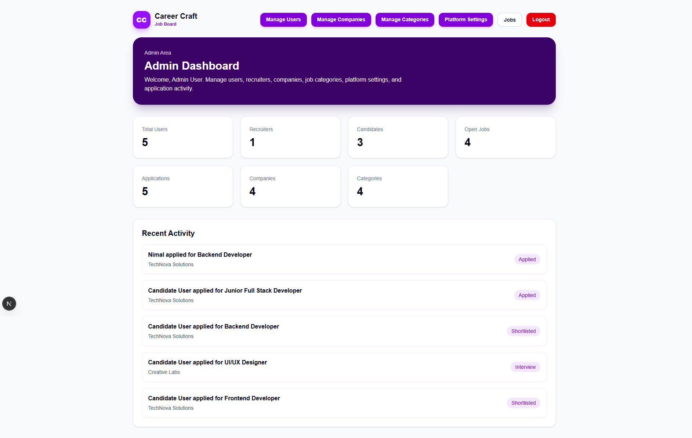

<div align="center">

# 🚀 Career Craft

### A modern full-stack job application platform for Candidates, Recruiters, and Admins.

Career Craft is a database-backed job board system built with **Next.js App Router**, **TypeScript**, **Tailwind CSS**, **Prisma**, and **PostgreSQL/Supabase**.

It includes role-based dashboards, job browsing, job applications, recruiter pipeline management, admin analytics, and a polished purple-themed UI.

---


</div>

---

## 📌 Project Overview

Career Craft is a full-stack job application system created for the CCA Full-Stack Development Assessment.

The platform supports three main user roles:

* **Admin**
* **Recruiter**
* **Candidate**

Each role has a protected dashboard and its own workflow.

Candidates can browse jobs, apply for jobs, update their profile, and track application progress.

Recruiters can create job posts, view applicants, and update application statuses.

Admins can monitor platform activity and manage users, companies, job categories, and platform settings.

---

## ✨ Main Features

### 🌐 Public Features

* Modern landing page with purple theme
* Public job listing page
* Job detail page
* Search jobs by title or company
* Filter jobs by location
* Filter jobs by job type
* Public header and footer
* Login page
* Register page
* Logout flow

---

### 👤 Candidate Features

* Candidate registration and login
* Protected candidate dashboard
* Candidate profile update form
* Skills section
* Education section
* Work experience section
* CV URL field
* Apply for jobs with a short cover letter
* Track submitted applications
* Application status timeline

Application statuses:

```text
Applied
Shortlisted
Interview
Offered
Rejected
```

---

### 🧑‍💼 Recruiter Features

* Protected recruiter dashboard
* Create new job posts
* View recruiter job posts
* View recent applicants
* Update application status
* Recruiter pipeline summary

Recruiter pipeline statuses:

```text
Applied
Shortlisted
Interview
Offered
Rejected
```

---

### 🛡️ Admin Features

* Protected admin dashboard
* Real dashboard analytics
* Recent activity section
* Manage users
* Manage companies
* Manage job categories
* Manage platform settings

Admin dashboard counts:

```text
Total Users
Recruiters
Candidates
Open Jobs
Applications
Companies
Categories
```

---

## 🎨 UI/UX Design

The application uses a polished purple theme with clean, modern layouts.

UI improvements include:

* Purple hero sections
* Clean white card layouts
* Modern rounded buttons
* Dashboard stat cards
* Responsive spacing
* Public header and footer
* Polished login and register pages
* Polished candidate dashboard
* Polished recruiter dashboard
* Polished admin dashboard
* Polished admin management pages

---

## 🛠️ Tech Stack

| Area            | Technology                          |
| --------------- | ----------------------------------- |
| Framework       | Next.js App Router                  |
| Language        | TypeScript                          |
| Styling         | Tailwind CSS                        |
| Database ORM    | Prisma                              |
| Database        | PostgreSQL / Supabase               |
| Authentication  | Custom session-based authentication |
| Data Handling   | Server Actions                      |
| Version Control | Git and GitHub                      |

---

## 📂 Project Structure

```text
career-craft/
├── app/
│   ├── admin/
│   │   ├── dashboard/
│   │   ├── users/
│   │   ├── companies/
│   │   ├── categories/
│   │   └── settings/
│   ├── candidate/
│   │   └── dashboard/
│   ├── recruiter/
│   │   └── dashboard/
│   ├── jobs/
│   │   ├── [id]/
│   │   └── page.tsx
│   ├── login/
│   ├── logout/
│   ├── register/
│   ├── globals.css
│   ├── layout.tsx
│   └── page.tsx
├── components/
│   ├── PublicHeader.tsx
│   └── PublicFooter.tsx
├── lib/
│   ├── auth.ts
│   └── prisma.ts
├── prisma/
│   ├── schema.prisma
│   └── seed.ts
├── public/
│   └── screenshots/
├── package.json
└── README.md
```

---

## 🧭 Main Routes

| Route                  | Description         |
| ---------------------- | ------------------- |
| `/`                    | Landing page        |
| `/jobs`                | Public jobs page    |
| `/jobs/[id]`           | Job details page    |
| `/login`               | Login page          |
| `/register`            | Register page       |
| `/logout`              | Logout route        |
| `/candidate/dashboard` | Candidate dashboard |
| `/recruiter/dashboard` | Recruiter dashboard |
| `/admin/dashboard`     | Admin dashboard     |
| `/admin/users`         | Manage users        |
| `/admin/companies`     | Manage companies    |
| `/admin/categories`    | Manage categories   |
| `/admin/settings`      | Platform settings   |

---

## 🔐 Test Login Credentials

Use these accounts after seeding the database.

### Admin Account

```text
Email: admin@careercraft.test
Password: Password123!
Role: Admin
```

### Recruiter Account

```text
Email: recruiter@careercraft.test
Password: Password123!
Role: Recruiter
```

### Candidate Account

```text
Email: candidate@careercraft.test
Password: Password123!
Role: Candidate
```

---

## ⚙️ Setup Instructions

### 1. Clone Repository

```bash
git clone YOUR_GITHUB_REPOSITORY_LINK
```

```bash
cd career-craft
```

### 2. Install Dependencies

```bash
npm install
```

### 3. Create Environment File

Create a `.env` file in the root folder.

```env
DATABASE_URL="your_postgresql_or_supabase_database_url"
```

Important:

```text
Do not commit the .env file to GitHub.
```

### 4. Generate Prisma Client

```bash
npx prisma generate
```

### 5. Run Database Migration

```bash
npx prisma migrate dev
```

### 6. Seed Database

```bash
npx prisma db seed
```

### 7. Run Development Server

```bash
npm run dev
```

Open:

```text
http://localhost:3000
```

### 8. Build Project

```bash
npm run build
```

Expected result:

```text
Compiled successfully
Finished TypeScript
Generated static pages successfully
```

---

## 📸 Screenshots

### Homepage



### Jobs Page



### Job Detail Page



### Login Page



### Register Page



### Candidate Dashboard



### Recruiter Dashboard



### Admin Dashboard



---

## 🗄️ Database Models

Main Prisma models:

```text
User
CandidateProfile
Skill
Education
WorkExperience
Company
Category
Job
Application
PlatformSetting
```

---

## 🔁 Application Workflow

### Candidate Flow

```text
Register / Login
↓
Update Profile
↓
Browse Jobs
↓
View Job Details
↓
Apply for Job
↓
Track Application Status
```

### Recruiter Flow

```text
Login
↓
Create Job Post
↓
View Recent Applicants
↓
Update Application Status
↓
Manage Job Pipeline
```

### Admin Flow

```text
Login
↓
View Dashboard Counts
↓
Manage Users
↓
Manage Companies
↓
Manage Categories
↓
Manage Platform Settings
```

---

## ✅ Completed Assessment Requirements

| Requirement                      | Status    |
| -------------------------------- | --------- |
| Next.js App Router               | Completed |
| TypeScript                       | Completed |
| Tailwind CSS                     | Completed |
| Real database with Prisma        | Completed |
| Login and registration           | Completed |
| Role-based dashboards            | Completed |
| Admin area                       | Completed |
| Recruiter area                   | Completed |
| Candidate area                   | Completed |
| Job listing                      | Completed |
| Job details                      | Completed |
| Search and filters               | Completed |
| Candidate application form       | Completed |
| Application status timeline      | Completed |
| Recruiter pipeline               | Completed |
| Admin counts and recent activity | Completed |
| Regular Git commits              | Completed |
| Production build                 | Completed |

---

## ⚠️ Current Limitations

These features can be improved in a future version:

* Real CV file upload is not implemented yet.
* The current version stores a CV URL.
* Interview scheduling with date, time, and meeting link can be added later.
* Email notifications can be added later.

---

## 🚀 Future Improvements

* Real CV upload with file storage
* Interview scheduling form
* Online meeting link support
* Email notification system
* Advanced applicant review page
* More detailed admin user controls
* Better mobile navigation

---

## 🧪 Final Build Status

The project was tested using:

```bash
npm run build
```

The build completed successfully.

---

## 📌 GitHub Workflow

This project was developed with regular Git commits from setup to final UI polish.

Completed commit stages include:

```text
Initial commit from Create Next App
build landing page
add prisma database schema
connect login page to database
protect dashboards by role
allow candidates to apply for jobs
allow recruiters to create job posts
show real admin dashboard counts
polish homepage design
polish jobs page
polish job detail page
polish candidate dashboard
polish recruiter dashboard
polish admin dashboard
polish admin management pages
polish authentication pages
```

---

## 👨‍🎓 Assessment Notes

This project was built as an individual practical assessment.

The focus areas were:

* Working full-stack functionality
* Real database usage
* Role-based access control
* Clean and usable UI
* Regular GitHub commits
* Clear README and test credentials
* Successful production build

---

<div align="center">

## 💜 Career Craft

A polished job application platform for modern hiring workflows.

</div>
